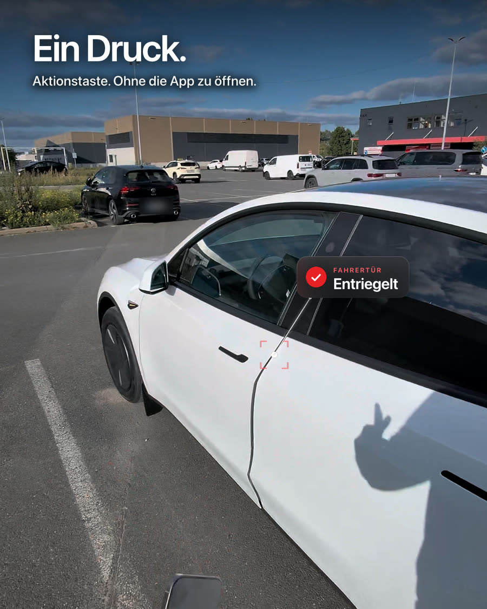
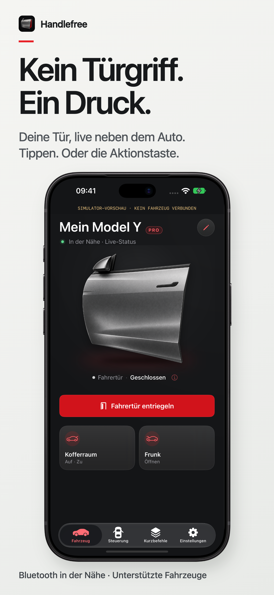
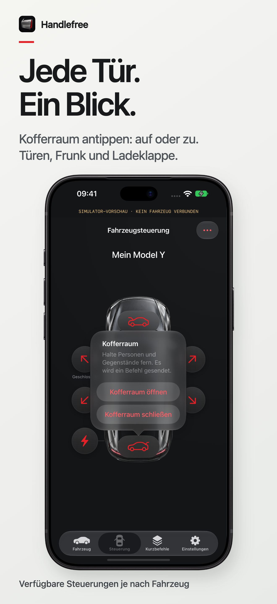
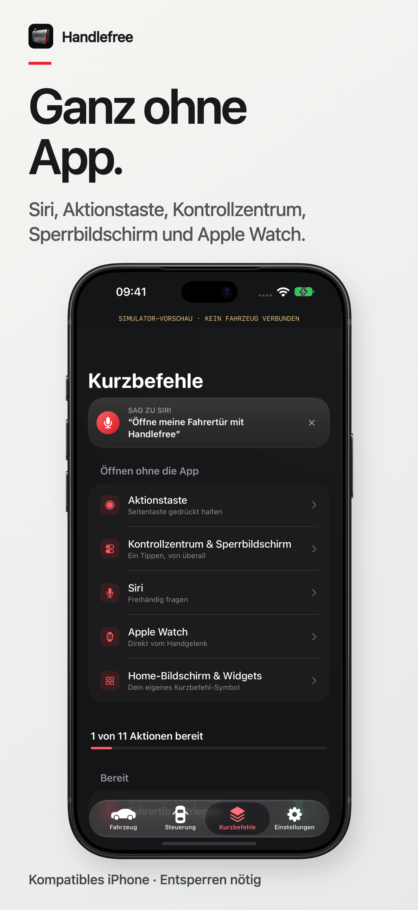
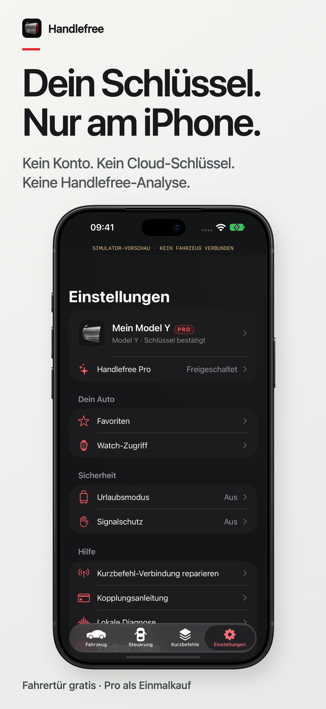

# Handlefree · Kein Türgriff mehr für deinen Tesla

**Kein Türgriff. Ein Druck.** · [English](README.md)

Handlefree (früher Teslatch) ist eine native iPhone-App, die die Tesla-Tür deiner Wahl über lokales Bluetooth öffnet. Entriegle die Fahrertür oder eine Beifahrertür, öffne Frunk und Kofferraum und öffne oder schließe die Ladeklappe: in der App, per Apple Kurzbefehl, mit der Aktionstaste des iPhone, über eine Steuerung im Kontrollzentrum oder mit deiner Apple Watch.

**[handlefree.app/de →](https://handlefree.app/de/)** · [Am echten Auto ansehen](https://handlefree.app/de/#real) · [Preise](https://handlefree.app/de/pricing/) · [Anleitungen](https://handlefree.app/de/guides/) · [Hilfe](https://handlefree.app/de/support/)

> **Jetzt im App Store.** Handlefree 1.0 ist seit dem 7. Oktober 2026 erhältlich. Der Download ist kostenlos, die Fahrertür bleibt dauerhaft kostenlos.
>
> Dies ist das offizielle **Produkt- und Feedback-Repository**, nicht der Quellcode der App. Die Fahrzeugsteuerung läuft in der nativen App, nicht im Browser.

## Gemacht für den Moment des Einsteigens

<table>
<tr><td width="33%"><h3>Meine Tür</h3>
Eine klare Steuerung für die Fahrertür, mit Siri, Kurzbefehlen, Aktionstaste und Kontrollzentrum, damit du den Zugang wählst, der zu dir passt.
</td><td width="33%"><h3>Jemanden einsteigen lassen</h3>
Wähle eine Beifahrertür auf einer Fahrzeugansicht oder lege deine meistgenutzten Steuerungen als Favoriten ab. Jede Tür ist eine eigene, benannte Aktion.
</td><td width="33%"><h3>Einladen</h3>
Frunk und Kofferraum erreichst du in derselben Oberfläche. Öffnen und Schließen des elektrischen Kofferraums sind getrennte Aktionen.
</td></tr>
</table>

### Am echten Auto

*Ein Druck auf die Aktionstaste des iPhone, in einem Durchgang am Auto des Entwicklers gefilmt und in Originalgeschwindigkeit gezeigt. [Clip auf handlefree.app ansehen](https://handlefree.app/de/#real). Fremde Kennzeichen und persönliche Angaben sind unkenntlich gemacht.*

### Die App im Detail

<table>
<tr><td width="50%"></td><td width="50%"></td></tr>
<tr><td></td><td></td></tr>
</table>

*App-Store-Screenshots von Handlefree 1.0, aufgenommen im iOS-Simulator. Der Hinweis „Simulator-Vorschau · kein Fahrzeug verbunden“ ist bewusst sichtbar. Die Grafik zeigt die Oberfläche; sie bestätigt kein bestimmtes Modell, keine Ausstattung und keine tatsächliche Türposition.*

## Was es nützlich macht

| Funktion | Was dich erwartet |
| --- | --- |
| **Tür entriegeln** | Entriegelt das Schloss der gewählten Tür in deiner Nähe. Entriegeln ist nicht dasselbe wie vollständiges Öffnen. |
| **Apple Kurzbefehle und Siri** | Siri-Sätze, native App Intents und fertige Kurzbefehle für unterstützte Aktionen. |
| **Aktionstaste des iPhone** | Lege einen Tür-Kurzbefehl auf ein iPhone mit Aktionstaste. |
| **Kontrollzentrum und Sperrbildschirm** | Eine feste Steuerung pro Tür ab iOS 18. Jede öffnet Handlefree und sendet genau diese Tür. |
| **Apple Watch** | Zugang zur Fahrertür, auch als Komplikation auf dem Zifferblatt, über das gekoppelte iPhone. |
| **Fahrzeugansicht** | Steuerungen für Türen, Frunk, Kofferraum und Ladeklappe, passend zu deiner Lenkradseite. |
| **Favoriten** | Zwei häufig genutzte Steuerungen direkt unter der Haupttaste. |
| **Ehrliche Rückmeldung** | Angefragt, vom Auto angenommen, als offen gemeldet oder nicht verfügbar, dazu die Dauer eines abgeschlossenen Befehls. Eine Bestätigung gilt nicht als Beweis, dass sich eine Tür bewegt hat. |
| **Urlaubsmodus** | Pausiert Handlefree-Befehle, bis du den Modus mit Face ID oder Code beendest. Andere Tesla-Schlüssel und Apps bleiben unberührt. |
| **Deutsch und Englisch** | Lokalisierte Oberfläche und Kurzbefehl-Begriffe. |

## Kostenlos und Pro

| Kostenlos | Handlefree Pro |
| --- | --- |
| Fahrertür entriegeln, verriegeln und entriegeln, in der App und per Siri, Kurzbefehl, Aktionstaste und Kontrollzentrum. Urlaubsmodus und alle Sicherheitseinstellungen. | Beifahrer- und hintere Türen, Frunk, Kofferraum, Ladeklappe und Apple Watch. |
| Dauerhaft kostenlos. | **9,99 € einmalig, Einführungspreis bis 31. Oktober 2026**, danach 19,99 € (im App Store in deiner Landeswährung). Kein Abo. Über die Familienfreigabe teilbar. |

Alle Pro-Funktionen kannst du **7 Tage** kostenlos testen, ab dem Koppeln deines Autos. Danach funktionieren die kostenlosen Funktionen weiter. Kauf wiederherstellen und Code einlösen findest du in der App. Die Zahlung wickelt Apple ab; Handlefree sieht deine Karte nie. Details: [handlefree.app/de/pricing](https://handlefree.app/de/pricing/).

## Datenschutz durch Architektur

- **Befehle über Bluetooth in der Nähe.** Keine Tesla Fleet API und keine Weiterleitung über das Internet.
- **Kein Tesla-Login.** Du koppelst einen lokalen Schlüssel mit deiner vorhandenen Schlüsselkarte.
- **Kein Handlefree-Konto, kein Server.** Kein Werbe- oder Analyse-SDK in der App.
- **Schlüssel bleiben auf dem iPhone.** Geschützt im gerätegebundenen Schlüsselbund; die Watch leitet Anfragen weiter und bekommt den Fahrzeugschlüssel nicht.
- **Diagnose nur auf Wunsch.** Kein automatischer Upload. Du prüfst selbst, was du teilst.

Apple verarbeitet Käufe im App Store. Wenn du an einer TestFlight-Beta teilnimmst, erhebt Apple Nutzungs- und Absturzdaten, die es mit dem Entwickler teilen kann. Die Website handlefree.app nutzt cookielose, zusammengefasste Vercel Web Analytics; die App selbst hat keine Analyse. GitHub und E-Mail-Anbieter verarbeiten Daten, wenn du ihre Dienste nutzt. Zur [Datenschutzerklärung](https://handlefree.app/de/privacy-policy/).

## Kompatibilität und aktueller Stand

| Voraussetzung | Aktueller Stand |
| --- | --- |
| iPhone | iOS 17 oder neuer (Kontrollzentrum und Sperrbildschirm ab iOS 18); Bluetooth an; ein kompatibler Tesla und eine vorhandene Schlüsselkarte zum Koppeln. |
| Apple Watch | watchOS 10 oder neuer; gekoppeltes iPhone in der Nähe. Diese Version ist kein eigenständiger Watch-Schlüssel. |
| Fahrzeuge | Teslas, die Bluetooth-Telefonschlüssel unterstützen. Bestätigt bisher: das Model Y des Entwicklers (alle vier Türen, Frunk und Kofferraum), das Model Y Standard eines Beta-Testers und Model 3, gemeldet von Besitzern. Das ist keine Freigabe für alle Fahrzeuge. |
| Model S und X | Fahrzeuge ab 2021 unterstützen Telefonschlüssel und sollten sich koppeln lassen, sind von Testern aber noch nicht bestätigt. Model S und X vor 2021 haben keinen Telefonschlüssel und lassen sich nicht koppeln. |
| Reichweite | Die Bluetooth-Reichweite schwankt. Es gibt keine garantierte Entfernung. |
| Ohne Fahrzeugstrom | Handlefree braucht ein Auto mit Strom in Reichweite. Im Notfall nutzt du die mechanische Notentriegelung aus deinem Handbuch. |
| Verfügbarkeit | iPhone, in allen App-Store-Ländern außer Frankreich. |

[Ausführliche Hinweise zur Kompatibilität (Englisch)](docs/COMPATIBILITY.md) · [Anleitungen](https://handlefree.app/de/guides/)

## Loslegen

1. Installiere Handlefree [aus dem App Store](https://apps.apple.com/app/handlefree-skip-the-handle/id6813757204).
2. Folge geparkt am Auto der Kopplungsanleitung in Handlefree, mit deiner vorhandenen Tesla-Schlüsselkarte am Kartenleser im Innenraum.
3. Teste jede Tür in der App und richte dann deinen Kurzbefehl, die Aktionstaste, das Kontrollzentrum oder die Watch ein.

Halte beim Testen den Tür- oder Ladebereich frei. Verlass dich nicht allein auf eine Animation als Beweis für eine Bewegung.

## Beliebte Anleitungen

- [Tesla-Tür mit der Aktionstaste des iPhone öffnen](https://handlefree.app/de/guides/action-button/)
- [Tesla Notentriegelung: Türen ohne Strom öffnen, nach Modell](https://handlefree.app/de/guides/manual-door-release/)
- [Tesla-Tür geht nicht auf: Ursachen und Lösungen](https://handlefree.app/de/guides/door-wont-open/)
- [Tesla-Ladeklappe öffnen: alle Wege erklärt](https://handlefree.app/de/guides/charge-port/)
- [Standby-Verbrauch beim Tesla: was ihn verursacht und was du abschalten kannst](https://handlefree.app/de/guides/tesla-standby-drain/)
- [Tesla Tipps und Tricks 2026: weniger bekannte Funktionen für Model Y und Model 3](https://handlefree.app/de/guides/tesla-tips-2026/)
- [Tesla im Winter: Vorklimatisieren, Laden und Eis](https://handlefree.app/de/guides/tesla-winter/)
- [Du überlegst, einen Tesla zu kaufen? Fang hier an](https://handlefree.app/de/guides/buying-a-tesla/)

[Alle Anleitungen auf Deutsch und Englisch →](https://handlefree.app/de/guides/)

## Häufige Fragen

**Ist Handlefree kostenlos?**

Fahrertür, Verriegeln und Entriegeln, Urlaubsmodus und alle Sicherheitseinstellungen sind kostenlos. Handlefree Pro ist ein Einmalkauf (9,99 € bis 31. Oktober 2026, danach 19,99 €) für die übrigen Türen, Frunk, Kofferraum, Ladeklappe und Apple Watch, mit 7 Tagen kostenlosem Test nach dem Koppeln.

**Funktioniert es ohne Internet?**

Befehle laufen über lokales Bluetooth, das Auto ist also auch in der Tiefgarage ohne Netz erreichbar. Installation, Käufe, Website und Support brauchen ihre jeweiligen Dienste. Das iPhone muss in der Nähe des Autos sein.

**Kann ich Beifahrer- oder hintere Türen öffnen, nicht nur die Fahrertür?**

Ja, bei unterstützten Fahrzeugen, mit Handlefree Pro oder während des Tests. Jede Tür ist eine eigene Aktion mit eigenem Kurzbefehl und eigener Steuerung im Kontrollzentrum. Teste jede Tür in der App, bevor du dich auf den Kurzbefehl verlässt.

**Funktioniert die Watch, wenn das iPhone gesperrt ist?**

Standardmäßig muss das iPhone entsperrt sein. Eine optionale Watch-Zugriffseinstellung erlaubt die Nutzung bei gesperrtem iPhone, nach Bestätigung durch den Besitzer und Einrichtung auf dem iPhone. Das gekoppelte iPhone muss trotzdem in der Nähe sein.

**Welche Teslas funktionieren?**

Teslas, die Bluetooth-Telefonschlüssel unterstützen. Model Y und Model 3 sind bestätigt. Model S und X ab 2021 unterstützen Telefonschlüssel; ältere lassen sich nicht koppeln. Teste jede Tür in der App, bevor du dich auf einen Kurzbefehl verlässt.

**Ersetzt Handlefree die Tesla-App?**

Handlefree konzentriert sich aufs Einsteigen. Behalte die Tesla-App für ihre weiteren Funktionen und Fernzugriffe.

**Warum der neue Name?**

Die Beta hieß Teslatch. Im September 2026 wurde sie in Handlefree umbenannt, damit der Produktname keine Marke von Tesla verwendet. Kopplungen und Einstellungen bleiben erhalten.

**Ist das Open Source?**

Nein. Dieses Repository veröffentlicht Produktinformationen und freigegebene Medien. Der Quellcode der App ist privat. Aus der Sichtbarkeit dieses Repositorys folgt keine Lizenz für Code oder Medien.

## Handlefree verbessern

Nutze einen [Fehlerbericht](https://github.com/onekapisch/handlefree/issues/new?template=bug-report.yml) für ein reproduzierbares Problem oder einen [Vorschlag](https://github.com/onekapisch/handlefree/issues/new?template=feature-request.yml) für eine konkrete Verbesserung beim Zugang. Gib App-Version, iPhone-/Watch-System und Fahrzeugmodell/-baujahr an, wenn relevant. Englisch oder Deutsch sind willkommen.

**Veröffentliche niemals deine FIN, Schlüsseldaten, Zugangsdaten, deinen genauen Standort oder ungeprüfte Diagnoseprotokolle in einem öffentlichen Issue.** Sicherheitsthemen meldest du [privat](SECURITY.md).

## Von OneKapisch

Entwickelt von **OneKapisch**, einem unabhängigen Softwarestudio aus 🇩🇪

[handlefree.app/de](https://handlefree.app/de/) · [Das Studio](https://www.onekapisch.com/) · [Weitere Apps](https://www.onekapisch.com/products/)

Handlefree ist eine unabhängige App und steht in keiner Verbindung zu Tesla, Inc. und wird nicht von Tesla unterstützt. Tesla und Fahrzeugnamen gehören ihren jeweiligen Inhabern. Apple, iPhone, Apple Watch, Siri und TestFlight sind Marken von Apple Inc. Die Grafiken sind stilisiert, keine offiziellen Tesla-CAD-Daten.

Produktinformationen geprüft am 9. Oktober 2026. Verfügbarkeit, Preise und Funktionen können sich ändern; aktuelle Angaben findest du auf handlefree.app.
