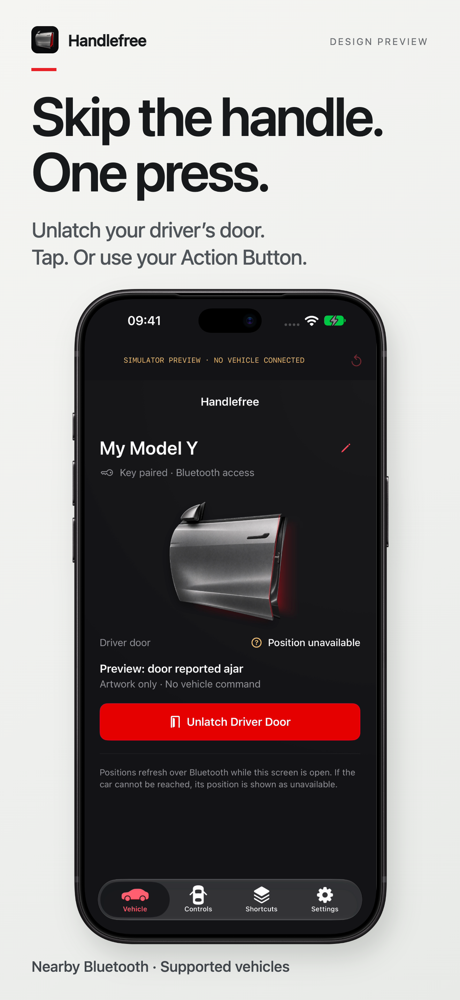
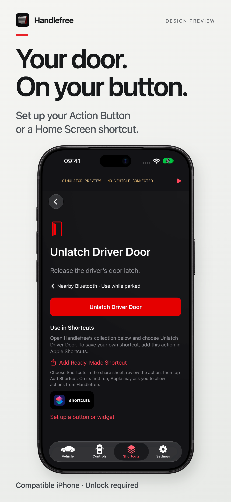
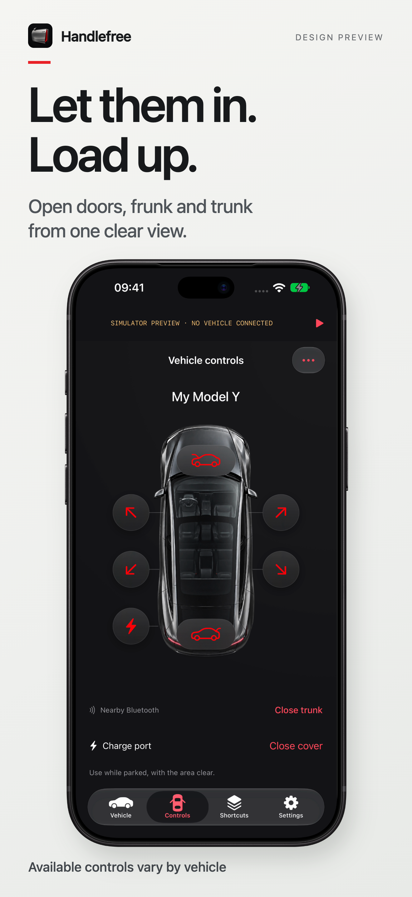
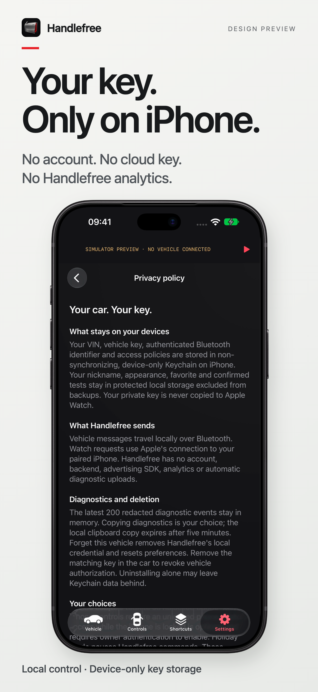

# Handlefree · Skip the handle for your Tesla

**Skip the handle. One press.**

Handlefree (formerly Teslatch) is a native iPhone app that opens the Tesla door you choose over local Bluetooth. Unlatch the driver door or a passenger door, open the frunk and trunk, and open or close the charge-port cover, from the app, an Apple Shortcut, the iPhone Action Button, a Control Center control or your Apple Watch.

**[handlefree.app →](https://handlefree.app/)** · **[Watch the film](https://www.onekapisch.com/handlefree/#film)** · [Guides](https://handlefree.app/guides/) · [Privacy](https://handlefree.app/privacy-policy/) · [Support](https://handlefree.app/support/) · [Deutsch](https://handlefree.app/de/)

> **In TestFlight beta.** The owner has tested the app on a Model Y. There is no public App Store download or public TestFlight link here yet; handlefree.app has current access information.
>
> This is the official **product showcase and feedback repository**, not the app's source code. Vehicle control is provided by the native app, not a browser.

## Built for the moment you get in

<table>
<tr><td width="33%"><h3>My door</h3>
A focused driver-door control, with Shortcuts, Action Button and Control Center access so you can use the entry point that suits you.
</td><td width="33%"><h3>Let someone in</h3>
Choose a passenger door on a visual vehicle layout, or keep your most-used door as a favourite. Each door is a separate, named action.
</td><td width="33%"><h3>Load the car</h3>
Reach the frunk and trunk through the same interface. Opening and powered-trunk closing remain separate actions.
</td></tr>
</table>

### The app, up close

<table>
<tr><td width="50%"></td><td width="50%"></td></tr>
<tr><td></td><td></td></tr>
</table>

*App previews captured in the iOS Simulator. Simulator labels remain visible. The artwork illustrates the interface; it does not certify a particular model, trim or physical door position.*

## What makes it useful

| Experience | What to expect |
| --- | --- |
| **Door unlatch** | Release the latch of the door you choose, nearby. Unlatching is different from fully opening a door. |
| **Apple Shortcuts and Siri** | Run supported actions through native App Intents and ready-made Shortcuts. |
| **iPhone Action Button** | Assign a door Shortcut on an iPhone with an Action Button. |
| **Control Center and Lock Screen** | One fixed control per door on iOS 18 or later. Each opens Handlefree and sends exactly that door. |
| **Apple Watch** | Driver-door access, including a watch-face entry point, relayed through the paired iPhone. |
| **Visual vehicle controls** | Spatial door, frunk, trunk and charge-port cover controls, mapped to your steering side. |
| **Honest feedback** | Requested, accepted by the car, reported open or unavailable, plus how long a completed command took. A command acknowledgement is not treated as proof that a door moved. |
| **Holiday Mode** | Pause Handlefree commands until you turn the mode off with Face ID or your passcode. Other Tesla keys and apps are unaffected. |
| **English and German** | Localized app interface and Shortcut vocabulary. |

## Privacy by architecture

- **Nearby Bluetooth commands.** No Tesla Fleet API or internet command relay.
- **No Tesla account login.** Pair a local key using your existing vehicle key card.
- **No Handlefree account or backend.** No app advertising or analytics SDK.
- **Keys stay on the iPhone.** Protected with device-only Keychain storage; the Watch relays requests rather than receiving the vehicle key.
- **Diagnostics are your choice.** No automatic diagnostic upload. Review anything you choose to share.

**TestFlight is a separate boundary:** Apple collects beta usage and crash information and can share it with the developer. GitHub, the website host and email providers also process data when you use those services. Read the [full privacy policy](https://handlefree.app/privacy-policy/).

## Compatibility and current evidence

| Requirement | Current position |
| --- | --- |
| iPhone | iOS 17 or later (Control Center controls need iOS 18); Bluetooth enabled; a compatible Tesla and an existing vehicle key card for pairing. |
| Apple Watch | watchOS 10 or later; paired iPhone nearby. This version is not a standalone Watch key. |
| Vehicles | Owner-reported success on one Model Y for all four doors, frunk and trunk. This is not fleet-wide certification. |
| Model 3, S and X | Presentation artwork is available. It is not evidence that commands work on every model, year or firmware. |
| Range | Bluetooth reachability varies. There is no guaranteed 10-metre distance boundary. |
| No vehicle power | Handlefree needs a powered, reachable car. In an emergency use the manual door release described in your owner's manual. |
| Price | Free during beta. Launch pricing is undecided; no subscription is planned. |

[Detailed compatibility notes](docs/COMPATIBILITY.md) · [Setup guides](https://handlefree.app/guides/)

## Getting started

1. Visit [handlefree.app](https://handlefree.app/) for current beta access information.
2. Once invited, install through Apple's TestFlight app.
3. While parked near the vehicle, follow Handlefree's pairing instructions with your existing Tesla key card. Use the interior reader location appropriate to your model.
4. Test each door in the app, then set up your preferred Shortcut, Action Button, Control Center or Watch control.

Keep the door or cargo area clear when testing. Do not rely on an animation alone to confirm physical movement.

## Questions people ask

**Can it work without internet?**

Vehicle commands use local Bluetooth, so the car can be reached in a garage without signal. TestFlight installation, website access and support communication require their respective services. The iPhone must still be near the car.

**Can I open a passenger or rear door, not just the driver's?**

Yes, on supported vehicles. Each door is a separate action with its own Shortcut and Control Center control. Test each door in the app before relying on its Shortcut.

**Does the Watch work with the iPhone locked?**

The default requires iPhone unlock. An optional Watch-access setting allows locked-phone use after owner authentication and setup on the iPhone. The paired phone is still required nearby.

**Does Handlefree replace the Tesla app?**

It focuses on getting into the car. Keep the Tesla app for its wider vehicle features and remote services.

**Why the new name?**

The beta was called Teslatch. It was renamed Handlefree in September 2026 so the product name does not use Tesla's trademark. Pairings and settings carry over.

**Is this open source?**

No. This repository publishes product information and approved media. The native app implementation is private. No source-code or media licence is granted by this repository being public.

## Help improve the beta

Use a [bug report](https://github.com/onekapisch/handlefree/issues/new?template=bug-report.yml) for a reproducible problem or a [feature suggestion](https://github.com/onekapisch/handlefree/issues/new?template=feature-request.yml) for a specific entry/access improvement. Include the app build, phone/Watch OS and vehicle model/year where relevant.

**Never post your VIN, key material, account credentials, precise location or unredacted diagnostic logs in a public issue.** Security concerns belong in [private reporting](SECURITY.md).

## Made by OneKapisch

Built by **Kapisch Bhardwaj**, an independent developer in Germany.

[handlefree.app](https://handlefree.app/) · [Explore the studio](https://www.onekapisch.com/) · [More apps](https://www.onekapisch.com/products/)

Handlefree is an independent app and is not affiliated with or endorsed by Tesla, Inc. Tesla and vehicle model names belong to their respective owners. Apple, iPhone, Apple Watch and TestFlight are trademarks of Apple Inc. Artwork is stylized, not official Tesla CAD.

Product information reviewed 23 September 2026. Beta capabilities and availability may change.
