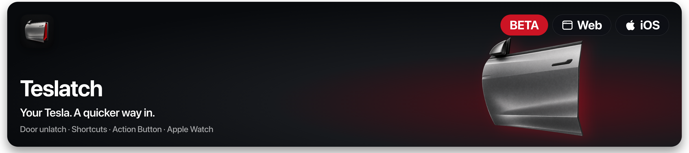

# Teslatch · Tesla door unlatch for iPhone

**Your Tesla. A quicker way in.**

Teslatch is a native iPhone app for nearby Tesla access over Bluetooth Low Energy. Unlatch the driver door from the app, an Apple Shortcut or a configured iPhone Action Button. An Apple Watch companion brings driver-door access to your wrist through your paired iPhone.

**[Explore Teslatch →](https://www.onekapisch.com/teslatch/)** · **[Watch the 24-second film](https://www.onekapisch.com/teslatch/#film)** · [Privacy](https://www.onekapisch.com/teslatch/privacy/) · [Support](https://www.onekapisch.com/teslatch/support/)

> **In TestFlight beta.** The owner has tested the TestFlight build on a Model Y. External invitations are being prepared; there is no public App Store download or public TestFlight link here yet. Visit the product page for current access information.
>
> This is the official **product showcase and feedback repository**, not the app's source code. The Web badge links to the website; vehicle control is provided by the native app, not a browser.

## Built for the moment you get in

<table>
<tr><td width="33%"><h3>My door</h3>
A focused driver-door control, with Shortcuts and Action Button access so you can use the entry point that suits you.
</td><td width="33%"><h3>Let someone in</h3>
Choose a passenger door using a visual vehicle layout. Available actions depend on your vehicle and confirmation during setup.
</td><td width="33%"><h3>Load the car</h3>
Reach the frunk and trunk through the same interface. Opening and powered-trunk closing remain separate actions.
</td></tr>
</table>

### The app, up close

<table>
<tr><td width="50%"></td><td width="50%"></td></tr>
<tr><td></td><td></td></tr>
</table>

*Approved app previews. Simulator labels remain visible. The artwork illustrates the interface; it does not certify a particular model, trim or physical door position.*

## What makes it useful

| Experience | What to expect |
| --- | --- |
| **Door unlatch** | Release the driver-door latch nearby. Unlatching is different from fully opening a door. |
| **Apple Shortcuts** | Run supported actions through native App Intents and the in-app Shortcuts setup. |
| **iPhone Action Button** | Assign the door Shortcut on an iPhone with an Action Button. |
| **Apple Watch** | Driver-door access, including a watch-face entry point, relayed through the paired iPhone. |
| **Visual vehicle controls** | Spatial door, frunk and trunk controls. Charge-port cover actions are included in the beta and still need broader physical testing. |
| **Holiday Mode** | Disable Teslatch commands until you turn the mode off. This does not disable other Tesla keys or apps. |
| **Meaningful feedback** | A command acknowledgement is distinguished from a confirmed vehicle position. Unavailable or stale state stays unknown. |
| **Personalization** | Your vehicle nickname and presentation artwork, independent of compatibility. |
| **English and German** | Localized app interface and Shortcut vocabulary. |

## Privacy by architecture

- **Nearby Bluetooth commands.** No Tesla Fleet API or internet command relay.
- **No Tesla account login.** Pair a local key using your existing vehicle key card.
- **No Teslatch account or backend.** No app advertising or analytics SDK.
- **Keys stay on the iPhone.** Protected with device-only Keychain storage; the Watch relays requests rather than receiving the vehicle key.
- **Diagnostics are your choice.** No automatic diagnostic upload by Teslatch. Review anything you choose to share.

**TestFlight is a separate boundary:** Apple collects beta usage and crash information and can share it with the developer. GitHub, the website host and email providers also process data when you use those services. “No app telemetry” does not mean those services collect nothing. Read the [full privacy policy](https://www.onekapisch.com/teslatch/privacy/).

## Compatibility and current evidence

| Requirement | Current position |
| --- | --- |
| iPhone | iOS 17 or later; Bluetooth enabled; a compatible Tesla and an existing paired vehicle key card. |
| Apple Watch | watchOS 10 or later; paired iPhone nearby. This version is not a standalone Watch key. |
| Vehicles | Owner-reported success on one Model Y for all four doors, frunk and trunk, plus TestFlight operation. This is not fleet-wide certification. |
| Model 3, S and X | Presentation artwork is available. It is not evidence that commands work on every model, year or firmware. |
| Range | Bluetooth reachability varies. There is no guaranteed 10-metre distance boundary. |
| Regions | France is excluded from the initial beta. |
| Price | Free during beta. Launch pricing remains undecided; no subscription is planned. |

[Detailed compatibility notes](docs/COMPATIBILITY.md) · [Setup and troubleshooting](https://www.onekapisch.com/teslatch/support/)

## Getting started

1. Visit the [Teslatch product page](https://www.onekapisch.com/teslatch/) for current beta access information.
2. Once invited, install through Apple's TestFlight app.
3. While parked near the vehicle, follow Teslatch's pairing instructions with your existing Tesla key card. Use the interior reader location appropriate to your model; not every vehicle uses the same location.
4. Verify the driver-door action in the app, then set up your preferred Shortcut, Action Button or Watch control.

Keep the door or cargo area clear when testing. Do not rely on an animation alone to confirm physical movement.

## Questions people ask

**Can it work without internet?**

Vehicle commands use local Bluetooth. TestFlight installation, website access and support communication require their respective services. The iPhone must still be near the car.

**Does the Watch work with the iPhone locked?**

The default requires iPhone unlock. An optional Watch-access setting allows locked-phone use after owner authentication and setup on the iPhone. The paired phone is still required nearby; device restart and system restrictions can affect access.

**Can I use the Watch Action Button?**

Only Apple Watch Ultra models have that button. Routing and reliability on specific hardware remain part of beta testing. Other watches use the app or watch-face entry point.

**Does Teslatch replace the Tesla app?**

It focuses on nearby vehicle entry. Keep the Tesla app for its wider vehicle features and remote services.

**Is this open source?**

No. This repository publishes product information and approved media. The native app implementation is private. No source-code or media licence is granted by this repository being public.

## Help improve the beta

Use a [bug report](https://github.com/onekapisch/teslatch-app/issues/new?template=bug-report.yml) for a reproducible problem or a [feature suggestion](https://github.com/onekapisch/teslatch-app/issues/new?template=feature-request.yml) for a specific entry/access improvement. Include the app build, phone/Watch OS and vehicle model/year where relevant.

**Never post your VIN, key material, account credentials, precise location or unredacted diagnostic logs in a public issue.** Security concerns belong in [private reporting](SECURITY.md).

## Made by OneKapisch

Built by **Kapisch Bhardwaj**, an independent developer in Germany.

[Explore the studio](https://www.onekapisch.com/) · [More apps](https://www.onekapisch.com/products/) · [Support](https://www.onekapisch.com/teslatch/support/)

Teslatch is an independent app and is not affiliated with or endorsed by Tesla, Inc. Tesla and vehicle model names belong to their respective owners. Apple, iPhone, Apple Watch and TestFlight are trademarks of Apple Inc. Artwork is stylized, not official Tesla CAD.

Product information reviewed 21 September 2026. Beta capabilities and availability may change.
