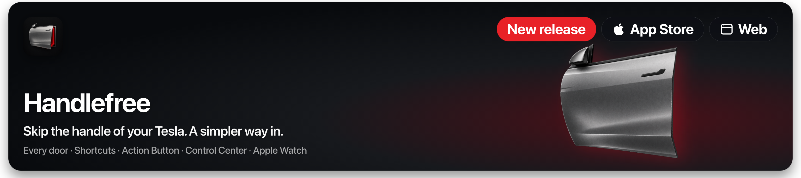
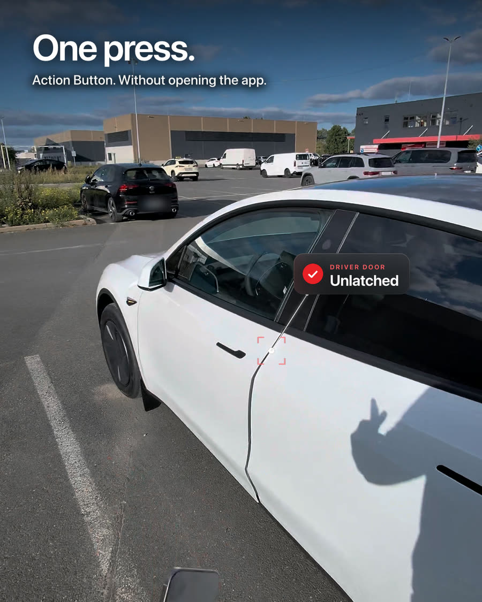
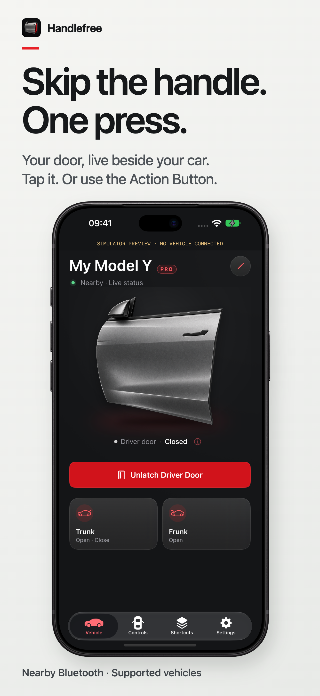
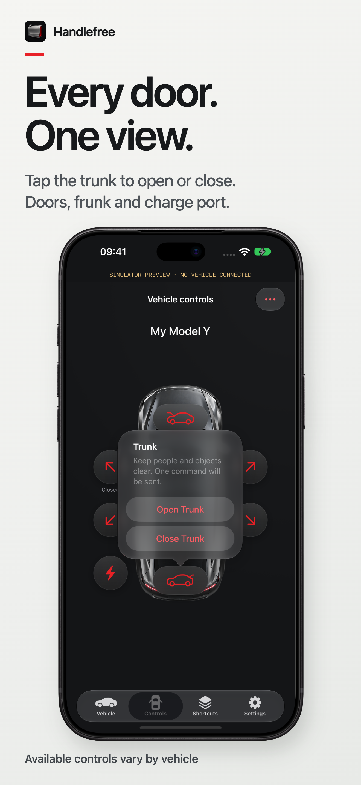
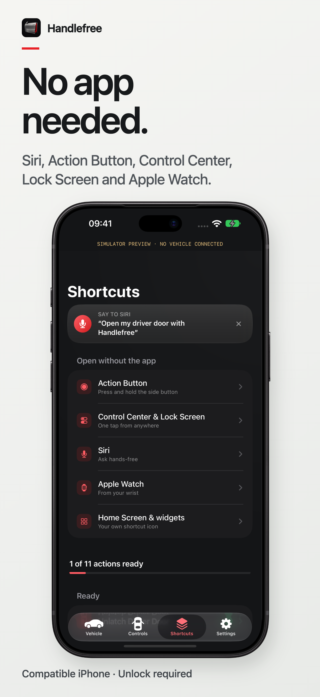
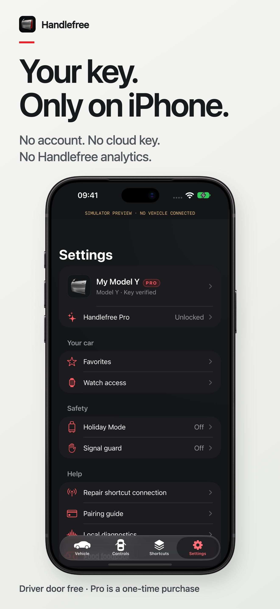

# Handlefree · Skip the handle for your Tesla

**Skip the handle. One press.** · [Deutsch](README.de.md)

Handlefree (formerly Teslatch) is a native iPhone app that opens the Tesla door you choose over local Bluetooth. Unlatch the driver door or a passenger door, open the frunk and trunk, and open or close the charge-port cover, from the app, an Apple Shortcut, the iPhone Action Button, a Control Center control or your Apple Watch.

**[handlefree.app →](https://handlefree.app/)** · [See it on a real car](https://handlefree.app/#real) · [Pricing](https://handlefree.app/pricing/) · [Guides](https://handlefree.app/guides/) · [Support](https://handlefree.app/support/)

> **Now on the App Store.** Handlefree 1.0 was released on 7 October 2026. It is free to download; the driver door stays free forever.
>
> This is the official **product showcase and feedback repository**, not the app's source code. Vehicle control happens in the native app, not in a browser.

## Built for the moment you get in

<table>
<tr><td width="33%"><h3>My door</h3>
A focused driver-door control, with Siri, Shortcuts, Action Button and Control Center access so you can use the entry point that suits you.
</td><td width="33%"><h3>Let someone in</h3>
Choose a passenger door on a visual vehicle layout, or keep your most-used controls as favorites. Each door is a separate, named action.
</td><td width="33%"><h3>Load the car</h3>
Reach the frunk and trunk through the same interface. Opening and closing the powered trunk are separate actions.
</td></tr>
</table>

### On a real car

*One press on the iPhone Action Button, filmed in one take on the developer's car and shown at original speed. [Watch the clip on handlefree.app](https://handlefree.app/#real). Other number plates and personal details are blurred.*

### The app, up close

<table>
<tr><td width="50%"></td><td width="50%"></td></tr>
<tr><td></td><td></td></tr>
</table>

*App Store screenshots of Handlefree 1.0, captured in the iOS Simulator. The "Simulator preview · No vehicle connected" label is visible on purpose. The artwork illustrates the interface; it does not certify a particular model, trim or physical door position.*

## What makes it useful

| Experience | What to expect |
| --- | --- |
| **Door unlatch** | Release the latch of the door you choose, nearby. Unlatching is different from fully opening a door. |
| **Apple Shortcuts and Siri** | Siri phrases, native App Intents and ready-made Shortcuts for supported actions. |
| **iPhone Action Button** | Assign a door Shortcut on an iPhone with an Action Button. |
| **Control Center and Lock Screen** | One fixed control per door on iOS 18 or later. Each opens Handlefree and sends exactly that door. |
| **Apple Watch** | Driver-door access, including a watch-face complication, relayed through the paired iPhone. |
| **Visual vehicle controls** | Spatial door, frunk, trunk and charge-port cover controls, mapped to your steering side. |
| **Favorites** | Keep two controls you use most right under the main button. |
| **Honest feedback** | Requested, accepted by the car, reported open or unavailable, plus how long a completed command took. A command acknowledgement is not treated as proof that a door moved. |
| **Holiday Mode** | Pause Handlefree commands until you turn the mode off with Face ID or your passcode. Other Tesla keys and apps are unaffected. |
| **English and German** | Localized app interface and Shortcut vocabulary. |

## Free and Pro

| Free | Handlefree Pro |
| --- | --- |
| Unlatch the driver door, lock and unlock, in the app and with Siri, Shortcuts, the Action Button and Control Center. Holiday Mode and every safety setting. | Passenger and rear doors, frunk, trunk, charge-port cover and Apple Watch. |
| Free forever. | **€9.99 once, launch price until 31 October 2026**, then €19.99 (local price on the App Store). No subscription. Shared with your family through Family Sharing. |

Every Pro feature is free to try for **7 days**, starting when you pair your car. Afterwards the free features keep working. Restore purchase and Redeem code are in the app. Payment is handled by Apple; Handlefree never sees your card. Details: [handlefree.app/pricing](https://handlefree.app/pricing/).

## Privacy by architecture

- **Nearby Bluetooth commands.** No Tesla Fleet API or internet command relay.
- **No Tesla account login.** Pair a local key using your existing vehicle key card.
- **No Handlefree account or backend.** No advertising or analytics SDK in the app.
- **Keys stay on the iPhone.** Protected with device-only Keychain storage; the Watch relays requests rather than receiving the vehicle key.
- **Diagnostics are your choice.** No automatic diagnostic upload. Review anything you choose to share.

Apple processes App Store purchases. If you join a TestFlight beta, Apple collects beta usage and crash information it can share with the developer. The website handlefree.app uses cookieless, aggregated Vercel Web Analytics; the app itself has no analytics. GitHub and email providers process data when you use those services. Read the [full privacy policy](https://handlefree.app/privacy-policy/).

## Compatibility and current evidence

| Requirement | Current position |
| --- | --- |
| iPhone | iOS 17 or later (Control Center and Lock Screen controls need iOS 18); Bluetooth enabled; a compatible Tesla and an existing vehicle key card for pairing. |
| Apple Watch | watchOS 10 or later; paired iPhone nearby. This version is not a standalone Watch key. |
| Vehicles | Teslas that support Bluetooth phone keys. Confirmed so far: the developer's Model Y (all four doors, frunk and trunk), a beta tester's Model Y Standard, and Model 3 cars reported by owners. This is not fleet-wide certification. |
| Model S and X | Cars built from 2021 support phone keys and should pair, but have not been confirmed by testers yet. Model S and X built before 2021 have no phone key and cannot pair. |
| Range | Bluetooth reachability varies. There is no guaranteed distance boundary. |
| No vehicle power | Handlefree needs a powered, reachable car. In an emergency use the manual door release described in your owner's manual. |
| Availability | iPhone, in every App Store region except France. |

[Detailed compatibility notes](docs/COMPATIBILITY.md) · [Setup guides](https://handlefree.app/guides/)

## Getting started

1. Install Handlefree [from the App Store](https://apps.apple.com/app/handlefree-skip-the-handle/id6813757204).
2. While parked near the vehicle, follow Handlefree's pairing instructions with your existing Tesla key card at the interior card reader for your model.
3. Test each door in the app, then set up your preferred Shortcut, Action Button, Control Center or Watch control.

Keep the door or cargo area clear when testing. Do not rely on an animation alone to confirm physical movement.

## Popular guides

- [Open your Tesla door with the iPhone Action Button](https://handlefree.app/guides/action-button/)
- [Tesla manual door release: opening doors with no power, by model](https://handlefree.app/guides/manual-door-release/)
- [Tesla door won’t open: causes and fixes](https://handlefree.app/guides/door-wont-open/)
- [Open your Tesla charge port: every way, explained](https://handlefree.app/guides/charge-port/)
- [What drains a parked Tesla, and what to switch off](https://handlefree.app/guides/tesla-standby-drain/)
- [Lesser-known Tesla tips for Model Y and Model 3 (2026)](https://handlefree.app/guides/tesla-tips-2026/)
- [Tesla in winter: preconditioning, charging and ice](https://handlefree.app/guides/tesla-winter/)
- [Thinking about a Tesla? Start here](https://handlefree.app/guides/buying-a-tesla/)

[All guides in English and German →](https://handlefree.app/guides/)

## Questions people ask

**Is Handlefree free?**

The driver door, locking and unlocking, Holiday Mode and all safety settings are free. Handlefree Pro is a one-time purchase (€9.99 until 31 October 2026, then €19.99) that adds the other doors, frunk, trunk, charge-port cover and Apple Watch, with a 7-day free trial after you pair your car.

**Can it work without internet?**

Vehicle commands use local Bluetooth, so the car can be reached in a garage without signal. Installation, purchases, website access and support need their respective services. The iPhone must still be near the car.

**Can I open a passenger or rear door, not just the driver's?**

Yes, on supported vehicles, with Handlefree Pro or during the trial. Each door is a separate action with its own Shortcut and Control Center control. Test each door in the app before relying on its Shortcut.

**Does the Watch work with the iPhone locked?**

By default the iPhone must be unlocked. An optional Watch-access setting allows locked-phone use after owner authentication and setup on the iPhone. The paired phone is still required nearby.

**Which Teslas work?**

Teslas that support Bluetooth phone keys. Model Y and Model 3 are confirmed. Model S and X from 2021 support phone keys; models built before 2021 cannot pair. Test each door in the app before relying on a Shortcut.

**Does Handlefree replace the Tesla app?**

It focuses on getting into the car. Keep the Tesla app for its wider vehicle features and remote services.

**Why the new name?**

The beta was called Teslatch. It was renamed Handlefree in September 2026 so the product name does not use Tesla's trademark. Pairings and settings carry over.

**Is this open source?**

No. This repository publishes product information and approved media. The native app implementation is private. No source-code or media licence is granted by this repository being public.

## Help improve Handlefree

Use a [bug report](https://github.com/onekapisch/handlefree/issues/new?template=bug-report.yml) for a reproducible problem or a [feature suggestion](https://github.com/onekapisch/handlefree/issues/new?template=feature-request.yml) for a specific entry or access improvement. Include the app version, phone/Watch OS and vehicle model/year where relevant.

**Never post your VIN, key material, account credentials, precise location or unredacted diagnostic logs in a public issue.** Security concerns belong in [private reporting](SECURITY.md).

## Made by OneKapisch

Built by **OneKapisch**, an independent software studio from 🇩🇪

[handlefree.app](https://handlefree.app/) · [Explore the studio](https://www.onekapisch.com/) · [More apps](https://www.onekapisch.com/products/)

Handlefree is an independent app and is not affiliated with or endorsed by Tesla, Inc. Tesla and vehicle model names belong to their respective owners. Apple, iPhone, Apple Watch, Siri and TestFlight are trademarks of Apple Inc. Artwork is stylized, not official Tesla CAD.

Product information reviewed 9 October 2026. Availability, prices and capabilities may change; handlefree.app has the current details.
